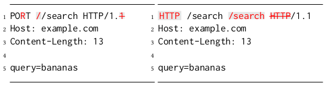

# T-Reqs HTTP Fuzzer
T-Reqs (**T**wo **Req**uest**s**) is a grammar-based HTTP Fuzzer written as a part of the [paper](http://seclab.nu/static/publications/ccs2021treqs.pdf) titled "T-Reqs: HTTP Request Smuggling with Differential Fuzzing" which was presented at [ACM CCS 2021](https://www.sigsac.org/ccs/CCS2021/accepted-papers.html).

<p align="center">
  
</p>

BibTeX of the paper:
```
@inproceedings{ccs2021treqs,
  title={T-Reqs: HTTP Request Smuggling with Differential Fuzzing},
  author={Jabiyev, Bahruz and Sprecher, Steven and Onarlioglu, Kaan and Kirda, Engin},
  booktitle={Proceedings of the 2021 ACM SIGSAC Conference on Computer and Communications Security},
  pages={1805--1820},
  year={2021}
}
```

## About
T-Reqs is for fuzzing HTTP servers by sending mutated HTTP requests with versions 1.1 and earlier. It has three main components: 1) generating inputs, 2) mutating generated inputs and 3) delivering them to the target server(s). 

### Generating Inputs
A CFG grammar fed into the fuzzer is used to generate HTTP requests. As the example grammar shown below is tailored for request line fuzzing, every request line component and possible values for each of them are explicitly specified. This allows us to generate valid requests with various forms of request line and also to treat each request line component as a separate unit from the mutation perspective.

```     	
 '<start>':
     ['<request>'],
 '<request>':
     ['<request-line><base><the-rest>'],
 '<request-line>':
     ['<method-name><space><uri><space><protocol><separator><version><newline>'],
 '<method-name>':
     ['GET', 'HEAD', 'POST', 'PUT', 'DELETE', 'CONNECT', 'OPTIONS', 'TRACE', 'PATCH'],
 '<space>':
     [' '],
 '<uri>':
     ['/_URI_'],
 '<protocol>':
     ['HTTP'],
 '<separator>':
     ['/'],
 '<version>':
     ['0.9', '1.0', '1.1'],
 '<newline>':
     ['\r\n'],
 '<base>':
     ['Host: _HOST_\r\nConnection:close\r\nX-Request-ID: _REQUEST_ID_\r\n'],
 '<the-rest>':
     ['Content-Length: 5\r\n\r\nBBBBBBBBBB'],
```
### Mutating Inputs
Each component can be marked in two ways: string mutable and tree mutable ([see](../main/config) the example configuration). If a component is string mutable, then a random character can be deleted, replaced, or inserted at a random position. In the example shown below (left side), the last character in the protocol version (*1*) is deleted, the third letter in the method name (*S*) is replaced with *R*, and a forward slash is inserted at the beginning of the URI. Whereas, if a component is tree mutable, then a random component can be deleted, replaced, or inserted at a random position under that component. The example below (right side) shows three tree mutations applied on the request line component: 1) *method* is replaced by *protocol*, 2) an extra *URI* is inserted after the current URI, and 3) the existing *proto* is deleted. 

 

## Usage

### Configuration
The fuzzer should be informed about the user preferences about the generation and mutation of inputs. More specifically, the input grammar, the mutable components, mutation preferences among other things should be specified in the configuration file (see an example [configuration](../main/config)). 

### Running modes
To be able to reproduce the inputs generated and mutated in each iteration, a seed number is used. In fact, this seed number serves as a seed for random number generations during the formation and mutation of an input. Depending on how these seeds are fed into the fuzzer, it runs in one of these two modes: individual and bulk. In the individual mode, inputs are generated and mutated based on the seeds specified by a user. In the command below, a single seed (i.e., 505) is specified. Alternatively, a list of seeds could be specified with *-f* option (see help page for more).

```
python3 main.py -i -c config -s 505
``` 

Whereas, in the bulk mode (which is default), it starts from zero as the seed value and increments it in each iteration until the end number is reached. The beginning and end numbers can be customized. 

```
python3 main.py -c config
``` 

## Dockerfile
We are also sharing a [Dockerfile](../main/Dockerfile) for you to be able to run the t-reqs code. You can run the commands below to get started:
```
# run the command below under the directory which has the Dockerfile
docker build -t test/treqs .

# create a container after you built the image using the command above
docker run -ti test/treqs bash

# run the commands below in the started docker shell
cd t-reqs/
python3 code/main.py -c config -n -i -s90
```

## Finding New HTTP Request Smuggling Vectors
HTTP Request Smuggling relies on different body parsing behaviors between servers where one server uses Transfer-Encoding header while the other prefers Content-Length header to decide the boundaries of a request body, or one server ignores a request body, whereas the other one processes it. 

To analyze the body parsing of servers in response to various mutations in various forms of an HTTP request, we need to have a feedback mechanism installed on those servers to tell us about the body parsing behavior. One way of installing a feedback mechanism on a server, is to run the server in the reverse-proxy mode and have it forward requests to a "feedback provider" script running as a service. This service measures the length of the body in received requests and saves it for comparing it later with other servers.

An example "[feedback provider](../main/code/feedback-server.py)" script is available in this repository. However, this script sends the body length information back in a response assuming that this information is stored on the client side.

## License
T-Reqs is [licensed](LICENSE) under MIT license.
